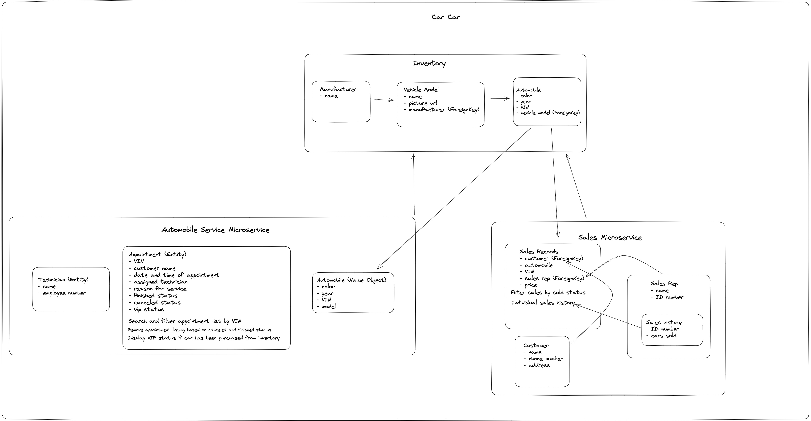

# CarCar

Team:

- Daniel Mitchell - Sales Microservice
- Sirasit Punnanithi - Service Microservice

## Design



This is the link to the repo where you will first need to go in order to fork and clone this project.

https://gitlab.com/spunnanithi/project-beta

1. You will select the fork option and enter your own username when filling out the information.
2. You will than select the clone option and copy the information to be entered into your terminal
3. In your terminal you will cd into your projects folder
4. You will enter the command git clone https://gitlab.com/(yourusername)/project-beta
5. You will then cd into the cloned projects folder
6. You then do these commands to create/build/start your container
   ```sh
   docker volume create beta-data
   docker-compose build
   docker-compose up
   ```
7. Once you have completed those steps you will be able to render the webpage using
   http://localhost:3000/ with 3000 being the port used.

---

## Inventory Microservice

### Front-End

### Back-End

### RESTful API CRUD Routes

---

## Service Microservice

### Front-End

#### Navigation Links

The React navigation bar features a dedicated "Service" dropdown menu to access the various links to create a technician, create a service appointment, view service appointment and view service appointment history by VIN.

#### Technician Form

The Technician Form page allows the user to create a technician by inputting the technician name and employee number in a form. Once the form is submitted, the form data will be converted to JSON and sent using a _POST_ HTTP request.

> Please see "Create view of technician" in the _**RESTful API CRUD Routes**_ section below for routing details.

#### Service Appointment Form

The Service Appointment Form page allows the user to create a service appointment by inputting the customer name, VIN, date/time, reason for service appointment and technician in a form. Once the form is submitted, the form data will be converted to JSON and sent using a _POST_ HTTP request.

> Please see "Create view of appointment" in the _**RESTful API CRUD Routes**_ section below for routing details.

#### Service Appointments List

The Service Appointment List page features a table that will list out all of the appointments that are currently not finished or canceled. The user is able to see if each respective customer/appointment/automobile is a VIP on the far-left side of the table. **_A yellow star indicates the customer is a VIP while a red 'X' indicates the customer is not a VIP._** Also, the user is able to click on the 'Finish' or 'Cancel' buttons to remove the appointment from the listing. The appointment will still be available in the database for the Appointment model but it will no longer get shown in the table.

> Please refer to "AutomobileVO (Value Object)" in the Models section below for more VIP information.

#### Service Appointment History by VIN

The Service Appointment History page features a search bar at the top of the page where the user can input a valid VIN to list out a history of appointment(s) for the related automobile. Only the associated automobile with the VIN will populate the table underneath the search bar.

### Back-End

#### Models

**Appointment (Entity)** - The Appointment model is considered an entity since it has a life cycle (active, canceled or finished) and its own unique identity. An appointment instance has its own unique properties such as VIN, customer name, date/time, reason for appointment and technician assigned to each appointment instance. Additionally, the Appointment model contains a property to keep track of the finished or canceled status of each appointment instance.

**Technician (Entity)** - The Technician model is considered an entity since it has its own unique identity. Two technicians both named "Ryan" are considered two different entities and can be identified using their employee number.

**AutomobileVO (Value Object)** - The AutomobileVO model is considered a value object since AutomobileVO instances have no identity or life cycles. Additionally, the data within AutomobileVO model should not be updated or deleted in any way. The data stored within this model is used to determine if the customer is considered a VIP.

> A customer is considered a VIP if the automobile VIN used while booking a service appointment matches the VIN from any automobile that is present in the Inventory microservice.

#### Polling

The Service microservice polls the Inventory microservice every 60 seconds to obtain Automobile model data and stores the data under the AutomobileVO model in the Service microservice.

> A _GET_ HTTP request was made to http://inventory-api:8000/api/automobiles/ to poll for Automobile data from Inventory microservice.

<br/>

### RESTful API CRUD Routes

> The appropriate RESTful API HTTP endpoints, used to view, create, update and delete, are listed below that will interact with the Appointment, Technician and AutomobileVO models, accordingly. These endpoints can be accessed using Insomnia or Insomnia-equilvalent application.

#### Appointments

**List view of appointments**

Send _GET_ request to http://localhost:8080/api/appointments/ <br/>

Sample return JSON response data:<br/>

```json
{
	"appointments": [
		{
			"id": 1,
			"vin": "1C3CC5FB2AN120174",
			"customer_name": "Betty",
			"date": "2023-03-03",
			"time": "06:20:08.937326",
			"reason": "Check engine light diagnosis",
			"is_finished": false,
			"is_vip": false,
			"technician": "Brian"
		},
		{
			"id": 3,
			"vin": "6GJ94YOC5SQ2O5A87",
			"customer_name": "Tim",
			"date": "2021-04-12",
			"time": "13:40:08.937326",
			"reason": "Check engine light diagnosis",
			"is_finished": true,
			"is_vip": false,
			"technician": "Robert"
		}
	]
}
```

<br/>

**Create view of appointment**

Send _POST_ request to http://localhost:8080/api/appointments/

Sample JSON request object to create new appointment: <br/>

```json
{
	"vin": "6GJ94YOC5SQ2O5A87",
	"customer_name": "Tim",
	"date": "2021-04-12T06:20:08.937326+00:00",
	"time": "2023-03-03T13:40:08.937326+00:00",
	"reason": "Check engine light diagnosis",
	"technician": 2
}
```

Sample return JSON response after sending POST request:<br/>

```json
{
	"vin": "6GJ94YOC5SQ2O5A87",
	"customer_name": "Tim",
	"date": "2021-04-12T06:20:08.937326+00:00",
	"time": "2023-03-03T13:40:08.937326+00:00",
	"reason": "Check engine light diagnosis",
	"is_finished": false,
	"is_vip": false,
	"technician": {
		"id": 2,
		"name": "Robert",
		"employee_number": 391032
	}
}
```

<br/>

**Detail view of individual appointment based on ID**

Send _GET_ request to http://localhost:8080/api/appointments/id/ <br/>

Sample return JSON response for individual appointment:

```json
{
	"id": 3,
	"vin": "6GJ94YOC5SQ2O5A87",
	"customer_name": "Tim",
	"date": "2021-04-12",
	"time": "13:40:08.937326",
	"reason": "Check engine light diagnosis",
	"is_finished": true,
	"is_vip": false,
	"technician": "Robert"
}
```

<br/>

**Update view for individual appointment based on ID**

Send _PUT_ request to http://localhost:8080/api/appointments/id/ <br/>

Sample JSON request object to update an appointment: <br/>

> **NOTE**: Depending on which properties need to change, the request below may feature less properties.

```json
{
	"customer_name": "Ryan",
	"reason": "Check engine light diagnosis",
	"technician": 2,
	"is_finished": true,
	"is_vip": false
}
```

Sample return JSON response after updating individual appointment:

```json
{
	"vin": "6GJ94YOC5SQ2O5A87",
	"customer_name": "Ryan",
	"date": "2021-04-12",
	"time": "13:40:08.937326",
	"reason": "Check engine light diagnosis",
	"is_finished": true,
	"is_vip": false,
	"technician": {
		"id": 2,
		"name": "Robert",
		"employee_number": 391032
	}
}
```

<br/>

**Delete view for individual appointment based on ID**

Send _DELETE_ request to http://localhost:8080/api/appointments/id/ <br/>

Sample return JSON response after succesfully deleting an appointment:<br/>

```json
{
	"vin": "14912939DKL9DSS2",
	"customer_name": "Jane",
	"reason": "Check engine light diagnosis",
	"is_finished": false,
	"is_vip": false,
	"technician": {
		"id": 2,
		"name": "Robert",
		"employee_number": 391032
	}
}
```

Sample return JSON response after deleting an appointment that does not exist:<br/>

```json
{
	"message": "Does not exist"
}
```

<br/>

#### Technicians

**List view of technicians**

Send _GET_ request to http://localhost:8080/api/technicians/<br/>

Sample return JSON response data: <br/>

```json
{
	"technicians": [
		{
			"id": 1,
			"name": "RieRie",
			"employee_number": 193428
		},
		{
			"id": 2,
			"name": "Robert",
			"employee_number": 391032
		}
	]
}
```

<br/>

**Create view of technician**

Send _POST_ request to http://localhost:8080/api/technicians/<br/>

Sample JSON request object to create a technician:<br/>

```json
{
	"name": "Robert",
	"employee_number": "391032"
}
```

Sample return JSON response after sending POST request:<br/>

```json
{
	"id": 2,
	"name": "Robert",
	"employee_number": "391032"
}
```

<br/>

**Detail view of individual technican based on ID**

Send _GET_ request to http://localhost:8080/api/technicians/id/<br/>

Sample return JSON response for an individual technician:<br/>

```json
{
	"id": 2,
	"name": "Robert",
	"employee_number": 391032
}
```

<br/>

#### AutomobileVO (Value Object)

**List view of automobilesVO that was polled from Inventory microservice**

Send _GET_ request to http://localhost:8080/api/automobiles/

Sample return JSON response data:<br/>

```json
{
	"autos": [
		{
			"import_vin": "/api/automobiles/1C3CC5FB2AN120321/",
			"color": "blue",
			"year": 2010
		},
		{
			"import_vin": "/api/automobiles/1C3D5FB2AN12dsfsd/",
			"color": "red",
			"year": 2014
		}
	]
}
```

---

## Sales microservice

The sales microservice is responsible for handling the creation of customers and our sales reps. Also providing lists of all sales with the ability to see the information of which sales rep made the sale. With a status for when cars have been sold or are still available for purchase. And to create sales with a customer, automobile, price, and sales rep. There are multiple foreign keys used to connect all of this information together in order for all our applications to work. We created multiple view functions to list, view, and create by using the GET, DELETE, and POST methods. We also implemented a poller in our poller.py file to connect our inventory with our sale microservice using our automobileVO model.

Explain your models and integration with the inventory
microservice, here.

The four Microservice models:

1. AutomobileVO:
   We use this model to deal with integrating the inventory microservice by implementing a value object using "vin" as the unique property. by using "vin" we are able to pull individual values of "automobile" from our inventory microservice. This makes it possible to use foreign key relationships between our sales history and automobile from inventory. in order to do all of this we created a pll function that is linked to the inventory microservice.

2. Customer:
   This model used the properties of name, address, and phone number to create a potential customer. Which is then used with our sales history.

3. SalesRep:
   The model used the properties of name and employee id, which is then used with our sales history.

4. SalesRecord:
   This model enabled the creation of a sales record using the other three models via a foreign key relationship. Then the price property was added.

MY NAMING CONVENTIONS FOR THIS PROJECT:

SalesRecordForm = Create a sale with customer, automobile, sales rep, and the price.

SalesRepHistory = Allows a drop down bar to select a specific sales rep and their sales history.

SalesList = A list with all all of the automobiles sold and information for sales rep, their employee id, the customer, vin, the sale price and a delete button.

SalesRepForm = (has the link title of "Add New Sales Rep") which has two input fields for name and employee id (which is a number).

CustomerForm = (has a link title of "Add New Customer") which has three input fields for name, address, and phone number.

SALES MICROSERVICE PORT:8090

SALES INSOMNIA URLS:

http://localhost:8090/api/salesrep/ (for the sale reps list and to create a new sales rep)

http://localhost:8090/api/salesrep/<int:id>/ (for the sales rep information)

http://localhost:8090/api/salesrep/<int:id>/record/ (for the sale records of individual employees)

http://localhost:8090/api/sale/ (for the sales list and to create a sale)

http://localhost:8090/api/sale/<int:id>/ (for the sale details and to delete a sale)

CUSTOMER INSOMNIA URLS:

http://localhost:8090/api/customer/ for the customer list and to create a customer
http://localhost:8090/api/customer/<int:id>/ for customer details

_when testing using insomnia the (task) corresponds with the link used_

TESTING CUSTOMER ASPECT:

- Test creating a customer here is the JSON body to use with a POST method.

{
"name": "Peter Parker",
"address": "20 ingram st, Queens, NY",
"phone": "123-456-7890",
}

(you will then be returned a "customer" array with name, address, phone, id)

- View the customer details you will need to add the id # into <int:id> using a GET method.

here is an example of how to do this:
{
"name": "Peter Parker",
"address": "20 ingram st, Queens, NY",
"phone": "123-456-7890",
"id": 3
}

after creating your customer you will have a unique id linked to their information. You will see that as 3 in the example above. you then replace the <int:id> with that id number, like shown below.

http://localhost:8090/api/customer/3/

(this will then return the individual customers information of name, address, phone number and unique id)

TESTING SALES ASPECT:

- Test creating a sales rep, here is the JSON body to use with a POST method.

{
"name": "test Rep 4",
"employee_id": 4
}

(you will then be returned a "salesrep" array with name, employee, and a unique id #)

- Test the creation of a automobile sale, here is the JSON body to use. You will need to use a POST method.(In order to create a sale a customer, automobile and sales rep must already be created)

{
"customer" : "Joe Dirt",
"automobile" : "12345678912345678", (vin number here)
"sales_rep": 1, (sale rep employee number)
"price" : 50000
}

(you will then be returned information for the sales rep, the customer, and automobile. which can also be viewed via sales list or sale detail)

- View an individual sales rep sales history you will need to use the GET method and add the employee_id into the <int:id> of the url. To test this you need to complete the steps above and created a successful sale.

{
"name": "Ron Burgundy",
"employee_id": 5,
"id": 5
}

below is an example of using the employee_id in the url for insomnia

http://localhost:8090/api/salesrep/5/record/

(this will return a "sales" array with all sales_rep, customer, and automobile information. including a sold status of True)

-View individual sales rep info is similar as the above process using Get method with an employee_id, you input their number into the url <int:id> in insomnia as shown in example below.

http://localhost:8090/api/salesrep/5/

(This will return the sales_rep name, employee_id, and id)

-View specific details of an automobile sale using GET method, you will need to locate the id below the price and then input that id in the url <int:id> in insomnia. You can find this id information by looking at the sales list url which will provide the id needed. Below is an example of implementing this.

{
"automobile": {
"year": 2023,
"import_href": "/api/automobiles/24689283475689/",
"color": "Black",
"vin": "24689283475689",
"sold": true,
"id": 6
},
"price": 50000,
"id": 42
}

http://localhost:8090/api/sale/42/

(this will return all the information involved with the automobile sale. Customer,sales_rep, automobile and price)

-Delete a sale is the same as the steps above using DELETE method in insomnia and implementing the use of ID in the same way.

FRONT-END WITH REACT:

1. Create customer => CustomerForm.js => (browser link) Add New Customer
   http://localhost:3000/sales/customer => url

2. Create sales rep => SalesRepForm.js => (browser link) Add New Sales Rep
   http://localhost:3000/sales/salesrep => url

3. Full sales list => SalesList.js => (browser link) Sales List
   http://localhost:3000/sales => url

4. Create sale => SalesRecordForm.js => (browser link) Record A New Sale
   http://localhost:3000/sales/new =>

5. Sales rep sale record => SalesRepHistory.js => (browser Link) Sales Rep History
   http://localhost:3000/sales/sales-history => url

6. This renders a form that requires three inputs which are name, address, and phone number. Once you click the submit button the customer is created and their information added to the database. The page then refreshes and is ready for another customers information.

7. This renders a form that requires two inputs which are name and employee ID. once you click the submit button the new sales rep is created and their information added to the database. The page then refreshes and is ready for another customers information.

8. This renders a list of all automobiles sold with the information for the sales rep who made the sale, their employee id, the customer who made the purchase, the VIN related to the vehicle, the sale price, and a delete button to remove any sales from the list.

9. this renders a form that requires four inputs that creates a new sale of an automobile. It uses a drop down bar for the automobile, the sales rep, and to choose a customer with all this information on the database. The automobiles are only the ones that have not been sold and are available for purchase. The last input is for the price of the automobile being sold and once the submit button is hit all the information is added to the database. And then can be viewed on the sales list and the sale reps history.

10. this renders a table with headers of sales representative, customer, vin, and price. In order for the table data to populate we need to select a sales reps by using the drop down bar that says "Choose A sales Representative". You can select different sales reps and the page will repopulate according to your selection.
